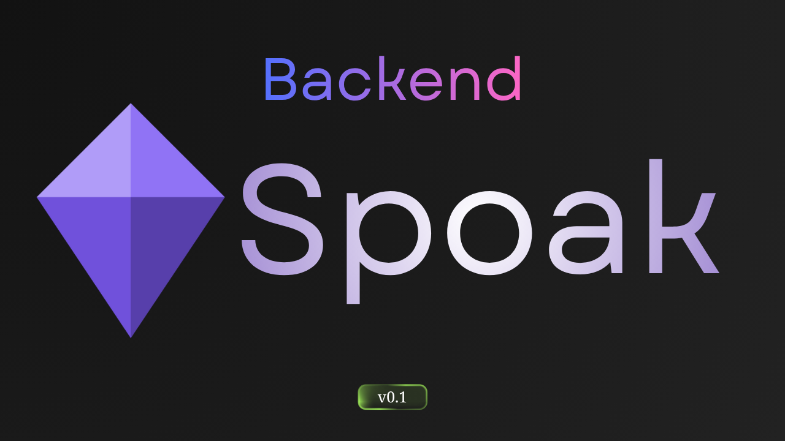

# Spoak Backend v0.1

Minecraft sunucu yöneticileri ve oyuncuları için araç koleksiyonu. Rust/Axum ile geliştirilmiş, [spoak-frontend](https://github.com/spoakk/frontend) ile çalışır.

[](https://github.com/spoakk/frontend)

## Endpoint'ler

| Endpoint | Açıklama |
|----------|----------|
| `GET /api/health` | Sağlık kontrolü |
| `GET /api/mcping?host=&port=` | Minecraft sunucusunu ping'le |
| `GET /api/player/:username` | UUID, skin ve oyuncu bilgilerini sorgula |
| `GET /api/seedmap/tile?seed=&x=&z=&size=&version=` | Biyom tile verisi üret (binary, i16 LE) |
| `GET /api/seedmap/structures?seed=&x=&z=&radius=&version=` | Seed'e göre yapı konumlarını bul |
| `GET /api/seedmap/versions` | Desteklenen Minecraft sürümleri |
| `GET /api/serverjars/versions` | Mojang sürüm listesi |
| `GET /api/serverjars/paper/:version/builds` | Paper build listesi |
| `GET /api/serverjars/paper/:version/latest` | En son kararlı Paper build'i |
| `GET /api/serverjars/leaf/:version/builds` | Leaf build listesi |

## Kurulum

```bash
git clone https://github.com/spoakk/backend
cd spoak-backend
cp .env.example .env
cargo run
```

## Ortam Değişkenleri

| Değişken | Varsayılan | Açıklama |
|----------|------------|----------|
| `PORT` | `4000` | Dinleme portu |
| `ALLOWED_ORIGINS` | `https://spoak.cc,http://localhost:3000` | Virgülle ayrılmış CORS origin listesi |
| `SENTRY_DSN` | — | Sentry DSN (isteğe bağlı) |

## Teknolojiler

- [Rust](https://www.rust-lang.org) — Dil
- [Axum 0.7](https://github.com/tokio-rs/axum) — Web framework
- [Tokio](https://tokio.rs) — Async runtime
- [cubiomes](https://github.com/Cubitect/cubiomes) — Minecraft biyom/yapı üretimi (C FFI)
- [Moka](https://github.com/moka-rs/moka) — Async önbellek
- [Sentry](https://sentry.io) — Hata takibi

## Gereksinimler

- Rust stable (1.75+)
- C derleyici (gcc / clang) — cubiomes C kaynak kodunu derlemek için gerekli

## Linkler

- [GitHub](https://github.com/spoakk)
- [Discord](https://discord.gg/SBbU3rCtGe)
